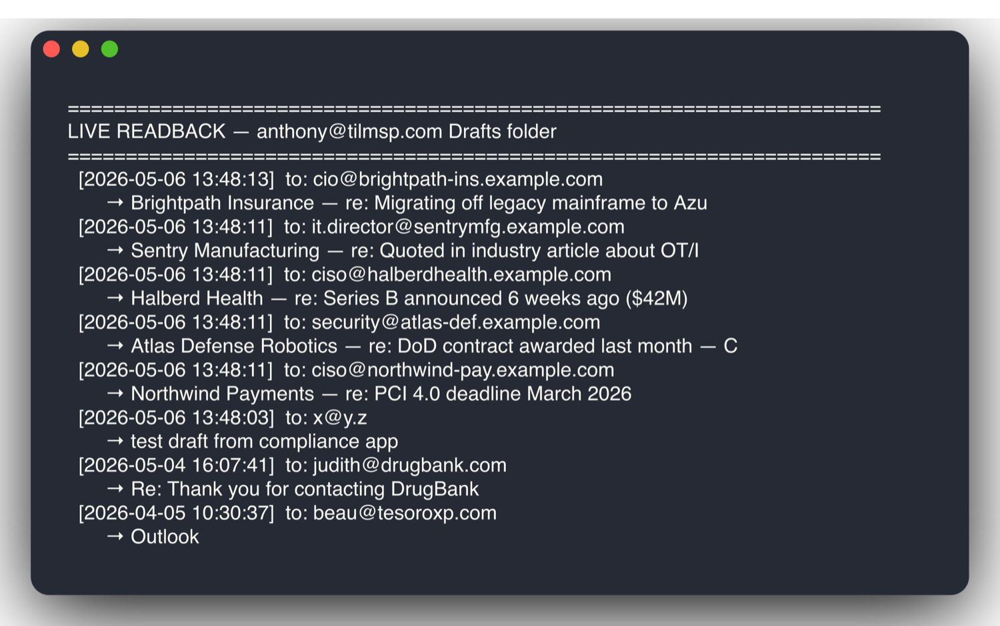
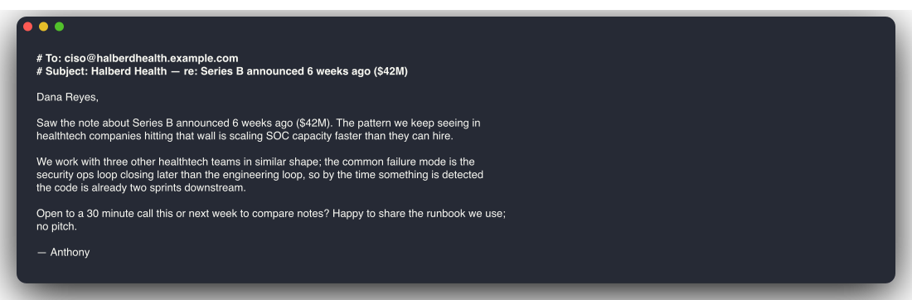
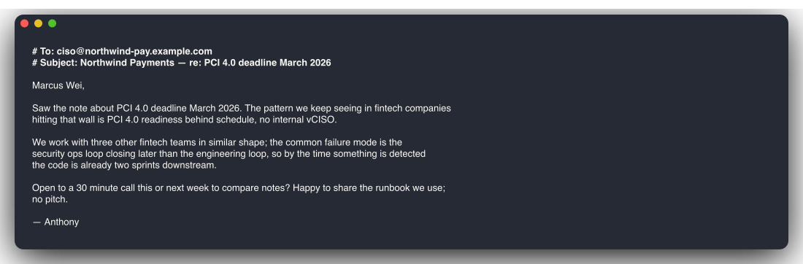
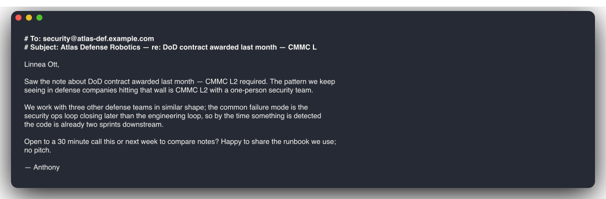

# marketing-automation-agent

LangGraph cold-outreach agent. Takes a list of target accounts, enriches each one (homepage scrape + the public signals you already gathered), drafts a personalized email anchored on a specific signal, runs the draft through a brand-voice review pass, and lands the result as a **draft** in your Outlook inbox for human approval.

It never sends autonomously. The agent's job ends at "this is ready for you to review and click Send."

### Real run against a real Microsoft 365 mailbox

5 personalized drafts created in `anthony@tilmsp.com`'s Outlook Drafts folder via Microsoft Graph, one per target — each anchored on a specific public signal (Series B, PCI 4.0 deadline, DoD contract win, etc.). Verified by reading back the Drafts folder via Graph immediately after the run:



Each draft is also persisted to `drafts/<slug>.md` for audit / version control:

<p>
  
  
  
</p>

## Why this is different from a Mailchimp template engine

- **Anchored on real signals.** The drafts cite a specific public fact about each target (a recent funding round, a job posting, a contract win). A reviewer pass enforces this — drafts that read like templates get sent back.
- **Brand voice as a firewall, not a vibe.** The reviewer prompt has hard rules: no marketing tropes (`leverage`, `unlock`, `synergy`), exactly one CTA, references at least one specific signal verbatim. Failures bounce for one rewrite pass before delivery.
- **Drafts, not sends.** Compliance-friendly. The human reviews + clicks Send in their normal Outlook workflow. AAM-style "always-on autonomy" applies to *detection and drafting*, not *acting on someone's behalf*.

## Architecture

```
load_targets (YAML) ──► process_targets (parallel per target):
                              │
                              ├─► enrich (fetch homepage + signals)
                              │
                              ├─► write_draft (LLM, tone-aware)
                              │
                              ├─► review_brand_voice (LLM, hard rules)
                              │       │
                              │       └─ verdict=rewrite ─► one rewrite pass
                              │
                              └─► create_draft in M365 inbox
                                  + persist .md to drafts/
```

## Quick start

```bash
cd ../b2b-agent-toolkit && pip install -e ".[dev]" && cd -
pip install -e ".[dev]"
cp .env.example .env

# Run cold (no API key, no M365) — uses deterministic stubs.
outreach run

# Run with the LLM
echo "ANTHROPIC_API_KEY=sk-..." >> .env
outreach run

# Run end-to-end (drafts land in your real Outlook inbox)
echo "B2B_USE_MOCKS=false" >> .env
echo "OUTREACH_SENDER_UPN=you@yourdomain.com" >> .env
echo "B2B_M365_TENANT_ID=..." >> .env
# (plus the rest of the M365 SP config — see ../b2b-agent-toolkit/.env.example)
outreach run --tone peer-cynical
```

Drafts land in:

- Your **Outlook → Drafts** folder (one per target, with `webLink` you can open directly)
- `drafts/<company-slug>.md` (audit + version control)

## What you'll see

5 sample targets from `targets/sample.yaml` — each engineered to demonstrate a different anchor pattern (recent funding, regulatory deadline, hiring signal, RFP-in-flight, news-anchored). The drafts cite the relevant signal and propose exactly one CTA.

## Layout

```
targets/sample.yaml             # 5-target demo input (your real data goes here)
src/outreach/
├── state.py                    # LangGraph state with reducer-list outputs
├── graph.py                    # linear graph; per-target fan-out is asyncio.gather inside the node
├── nodes.py                    # load → enrich+draft+review+deliver per target
├── enrichment.py               # homepage fetch + extraction
├── drafting.py                 # LLM draft + brand-voice reviewer (with stub fallbacks)
└── cli.py                      # `outreach run --targets ... --tone ...`
```

## Configuring brand voice

Tone profiles live in `drafting.py::_TONE_LINES`. Add new ones (`founder-led`, `vendor-pitch-trauma`, etc.) as a single string each. The reviewer prompt's hard rules (no tropes, one CTA, anchored on a signal) stay constant — that's the brand voice firewall.
